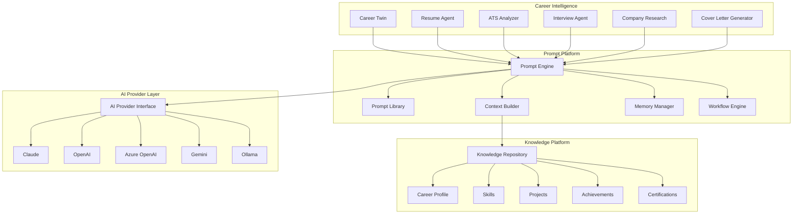

# Component Diagram

## Overview

The Component Diagram illustrates the internal modules of AI Job Hunt OS and their relationships.

The architecture is designed using modular principles so that new capabilities can be added without modifying existing business logic.

---

---

## Design Principles

- Modular architecture
- Separation of concerns
- AI provider abstraction
- Shared prompt orchestration
- Centralized career knowledge
- Extensible by design

---

## Future Components

The following modules are planned for future releases:

- LinkedIn Optimizer
- Salary Negotiation Agent
- Portfolio Analyzer
- Mock Interview Coach
- Application Tracker
- Career Analytics Dashboard