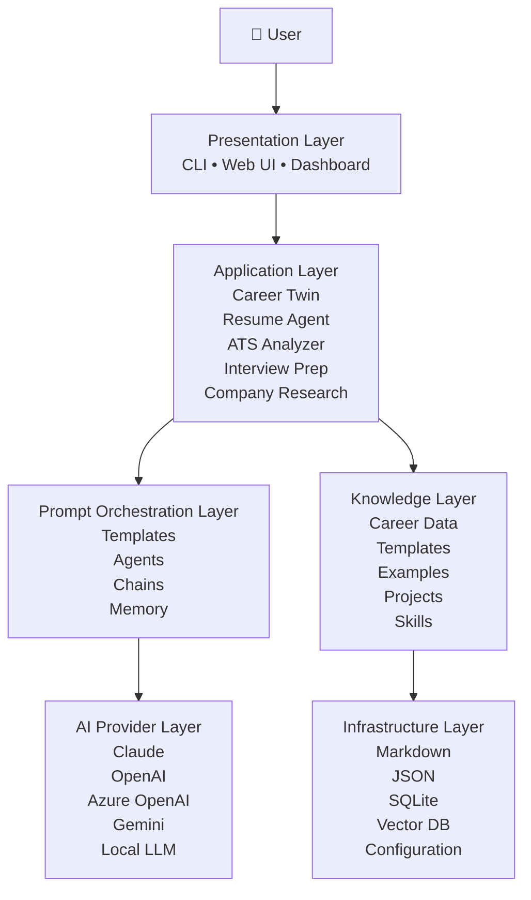

# High-Level Architecture

## Overview

AI Job Hunt OS follows a layered architecture to ensure modularity, maintainability, scalability, and AI provider independence.

The system separates business logic from prompt orchestration, AI providers, and persistent knowledge, allowing each layer to evolve independently.

---

## Architectural Principles

- Separation of Concerns
- Modular Design
- AI Provider Independence
- Documentation First
- Knowledge-Centric Architecture
- Extensible by Design

---

## High-Level Architecture

---

## Layer Responsibilities

| Layer | Responsibility |
|---------|----------------|
| Presentation | User interaction |
| Application | Business capabilities |
| Prompt Orchestration | Prompt engineering |
| AI Provider | LLM abstraction |
| Knowledge | Persistent career intelligence |
| Infrastructure | Storage and configuration |

---

## Benefits

- Vendor independent
- Modular
- Easily testable
- Future-proof
- Open-source friendly
- Easy onboarding