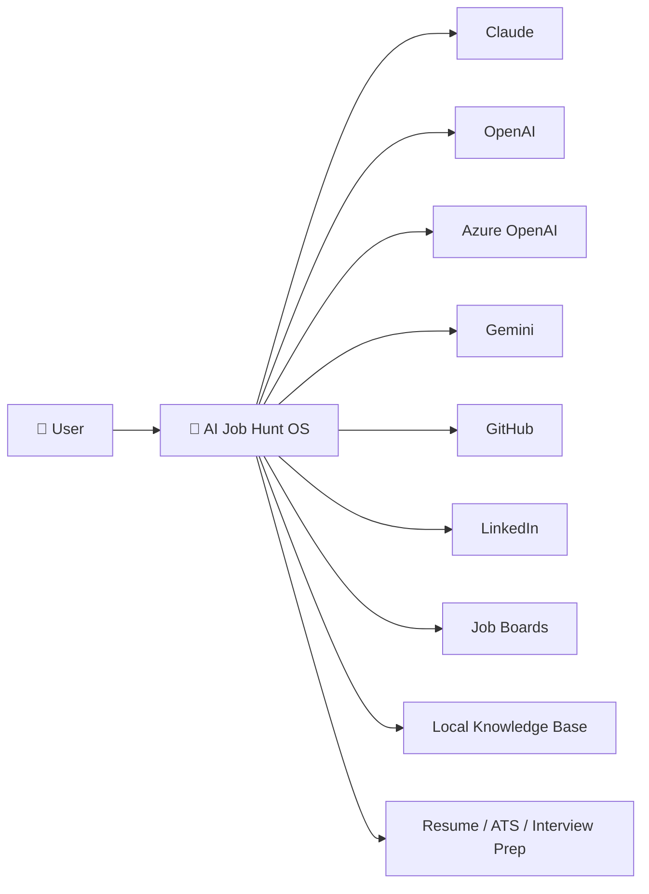

# System Context Diagram

## Overview

The System Context Diagram illustrates how AI Job Hunt OS interacts with external users, AI providers, data sources, and output artifacts.

The platform serves as the orchestration layer between career knowledge, AI models, and automation workflows.

---

